# Operationalizing Machine Learning

## Overview
This project is part of the Udacity Azure ML Engineer Nanodegree. It is the second project after the first project [Optimizing a Pipeline in Azure](https://github.com/donjude/nd00333_AZMLND_Optimizing_a_Pipeline_in_Azure-Solution), to build and productionalized an Azure Auto ML model.

In this project I trained and deployed an Azure Auto ML model into production. Azure Container Instance (ACI) was used in deploying the model as a webservice REST API. The REST API endpoint was exposed and can be consumed as an HTTP request by any application.

In the other part of the project I created a Machine Learning pipeline using Azure Machine Learning SDK. The pipeline was also deployed as a REST API endpoint. HTTP request to the pipeline can re-train the machine learning model and also perform scoring from the existing machine learning model.

The main focus of the project is about Productionalizing a Machine Learning Model, so we would not be focusing on optimization or creating a perfect machine learning model, but rather show the processes and the steps in which machine learning models in Azure ML are productionalized.

This project made use of the benchmarking dataset as described in [Project One](https://github.com/donjude/nd00333_AZMLND_Optimizing_a_Pipeline_in_Azure-Solution)
 
 

## Architectural Diagram
This diagram below visualizes the flow of operations of this project from start to finish.

 

## Key Steps
The key steps followed have further been explained below. I leverage my own Azure ML workspace so authentication with service principal was necessary to enable my desktop automate the SDK and other runs smoothly without any interactive logins.

The next step was registering the bankmarketing dataset and then creating an Azure Auto ML model. The best model for the Azure Auto ML was chosen and deployed as a Web Service REST API using Azure Container Instance (ACI).

Application insights and logging was enabled to monitor the performance of the deployed machine learning model as well as to log all errors when they occur.

The Auto ML model endpoint was consumed with a python HTTP request script for a successful result.

An Azure Machine learning pipeline was created and published using Azure Machine Learning SDK and finally the process was documented.

Below are the various descriptions of the Key steps that were followed for the model productionalization.

1. **Authentication:** It is the process of verfifying the identify of a user or a process. In this project the authentication process that is used to authenticate the Azure Machine Learning workspace is the **Service Principal** authentication workflow. The service principal was used because of the automated process that is required for authentication during modeling training, updates and deployment processes that wouldn't require user interaction.

    > **Service Principal:** is a security identity used by user-created applications, services and automation tools to access specific Azure resources.

    **Authentication and Service Principal configuration**
    Instructions:
    - Make sure azure cli is install and login to Azure from the bash shell.
    - Install the Azure Machine Learning extension.
    - Create a Service Principal and enable Azure active directory role base authentication for SDK.
    - Allow the Service Principal to have access to Azure ML workspace.

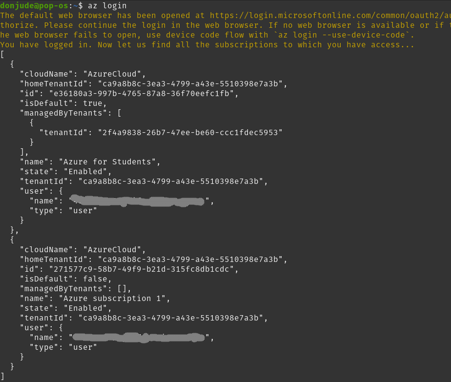
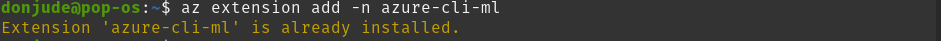
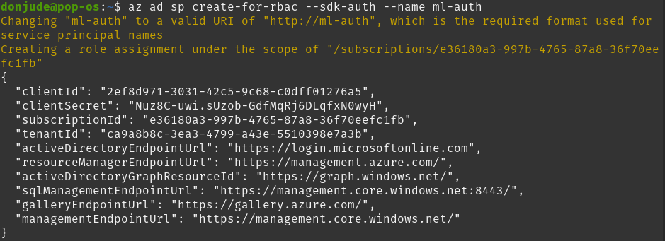
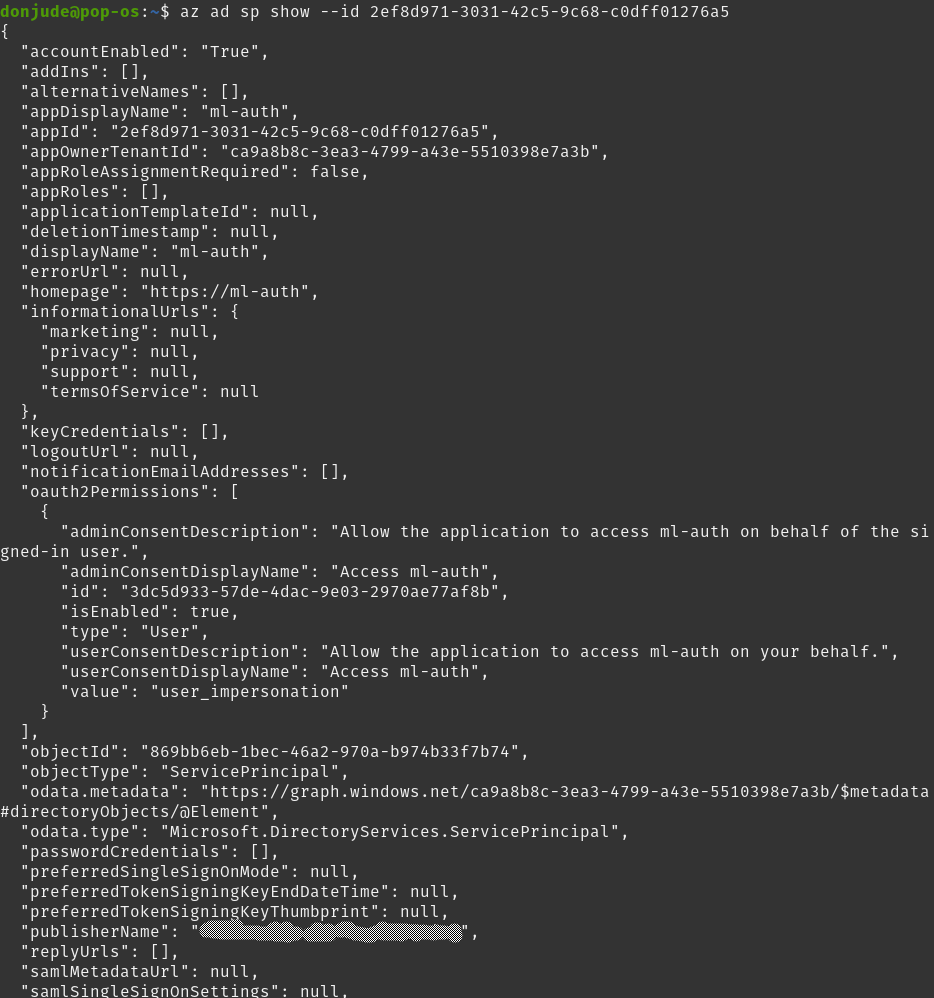
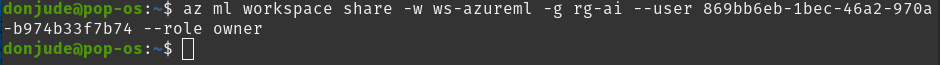

 

2. **Automated ML Experiment:** At this step the machine learning experiment is created using Automated ML. This experiment consist of setting up your workspace, setting up your auto ml configurations, configuring a compute cluster and using the compute cluster to run the experiment. Several machine learning models are produced by this step in addition to the best model.

    **Registered Dataset**
    - Create an register the Bankmarketing dataset in your workspace.

    

    **Completed Experiment**
    - Create and run an Auto ML experiment.

    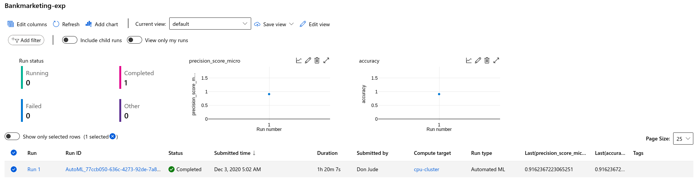

    **Best Model**
    - Auto ML after a successful execution selections the best model created by the experiment.

    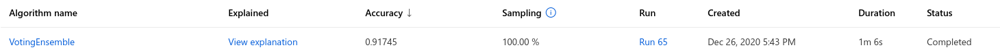
    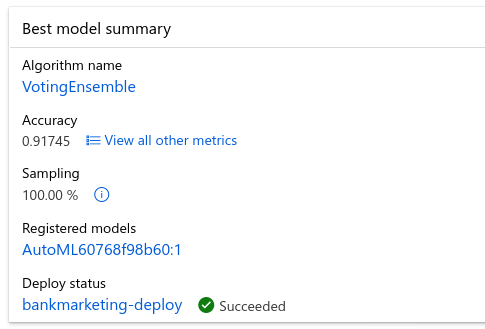

3. **Deploy the best model:** Deploying a machine learning model is the process of shipping machine learning models to production environment so that it can provide predictions that can be consumed by other processes, applications or software. Machine learning models only become useful when they are deployed because it is at this stage that the value of the modelling process can be realized.

    **Model Deployment**
    - Deploy the best model chosen by Auto ML as Azure Container Instance (ACI)

    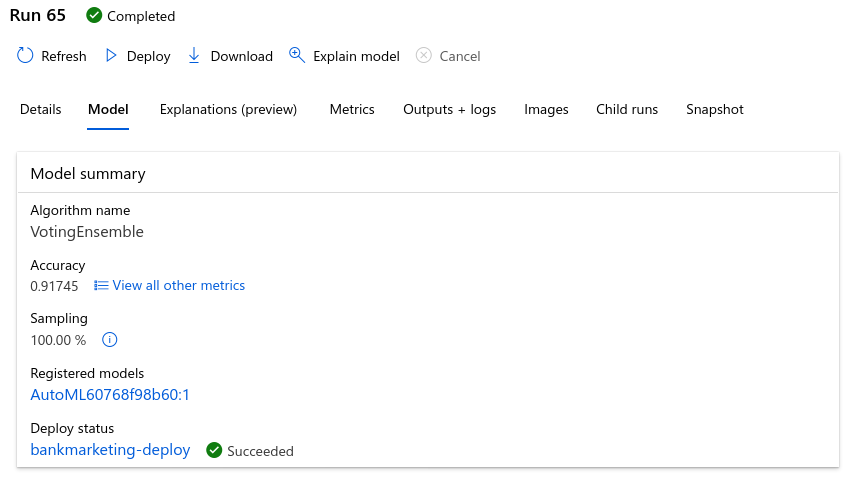

4. **Enable logging:**
    - Enable Application Insights
    - Run the code `python logs.py` to view the logs for Application Insights.
    - Check to see application insights is enabled in the screen shot below.

    **Application logging**
    Application insight was enable to actually monitor the performance of the deployed model and enable errors that the model experience.
    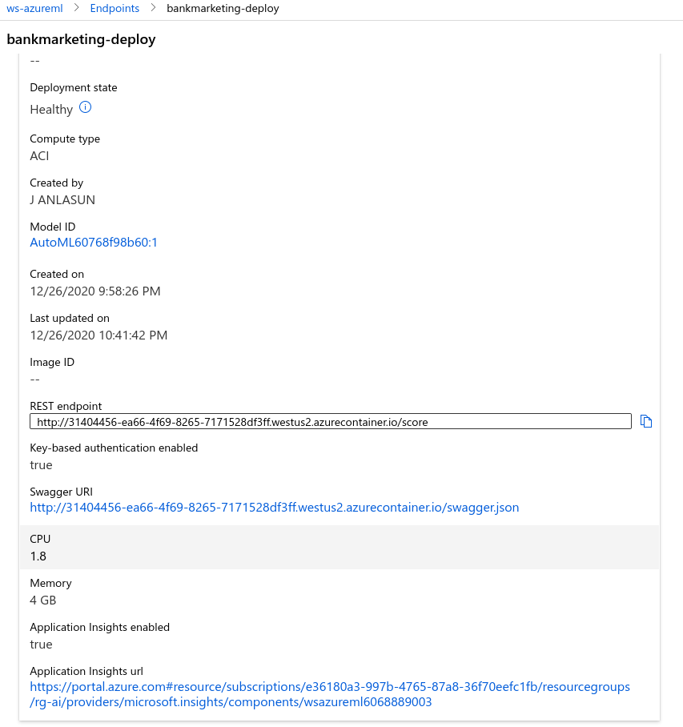

    **logging with** `log.py`
    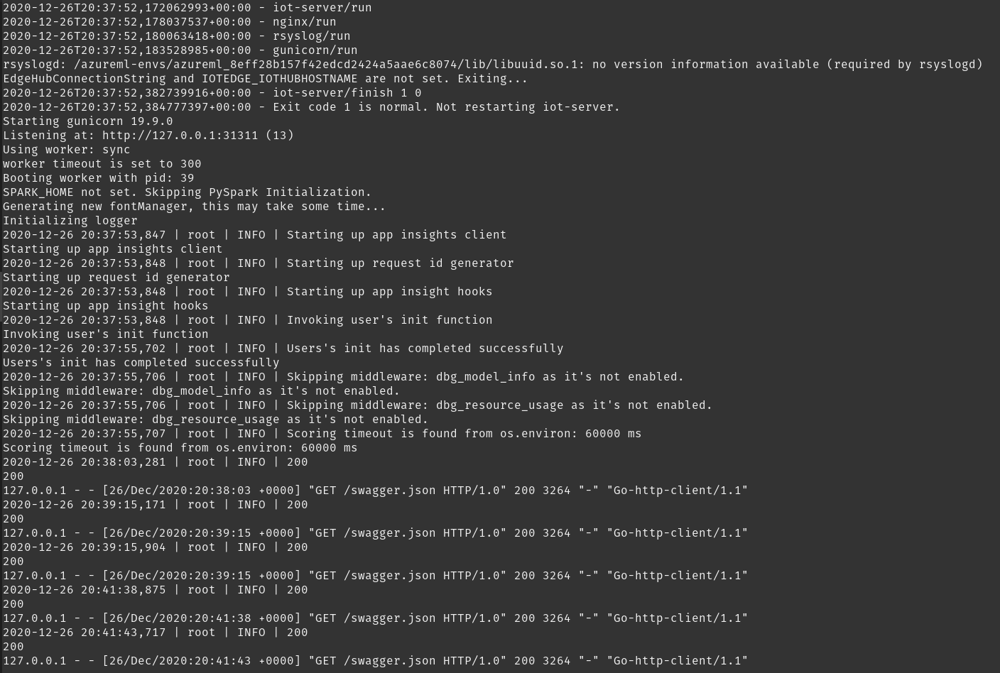

 

5. **Swagger Documentation:** Swagger is a tool that helps build, document, and consume RESTful web services. It eases the documentation efforts of HTTP APIs. Azure supports Swagger and in this project Swagger was used to consume the API for the deployed Machine Learning model.
    - Download the `swagger.json` file from the screen shot above.
    - Make sure the file is placed in the `swagger` folder together with the other files `serve.py` and `swagger.sh`.
    - Change the port 80 in the `swagger.sh` file to `9080`.
    - Run the code `bash swagger.sh` and `python serve.py`
    - Type `http://localhost:9080` in the browser to open the swagger documentation.
    - In the Swagger interface type `http://localhost:8000/swagger.json` and click on Explore to display the contents of the API for the model.

    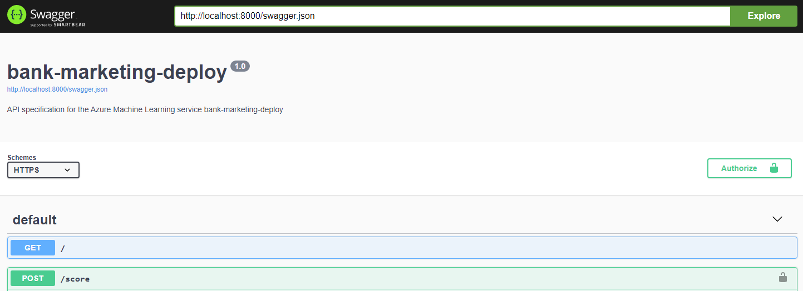
    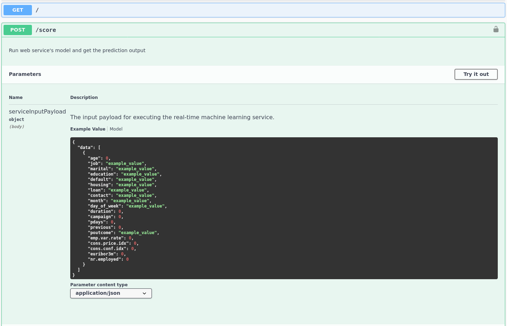
    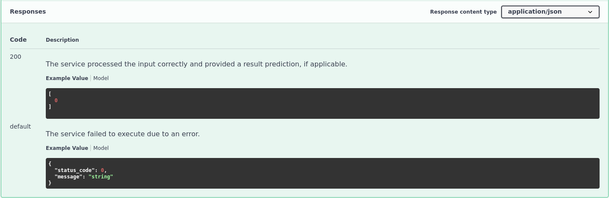

 

6. **Consume model endpoints:** The deployed machine learning model can be consumed through a model endpoint. An endpoint is an HTTP API or URL(s) that is exposed over the network so that interactions can happened with a trained model via HTTP requests (GET or POST). The screen shot belows shows the results that was return by two data points when I made a request to my model.

    - Edit the `endpoint.py` script and replace the scoring URL and the keys with details provided from the deployed model in azure workspace.
    - Consume the model by executing the script `python endpoint.py`
    - The results represents the score from two datapoints in the `endpoint.py` json pyaloader.

    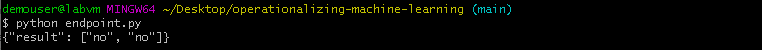

    **Benchmarking** Benchmarking was screated to enhance performance and also for the purpose of anomally detection.

    - Install Apache Bencmark command-line tool
    - Edit the API URL and key in the `benchmark.sh` script to match that of the deployed model endpoint.
    - Run `benchmark.sh` to retrieve the performance results as seen below.

    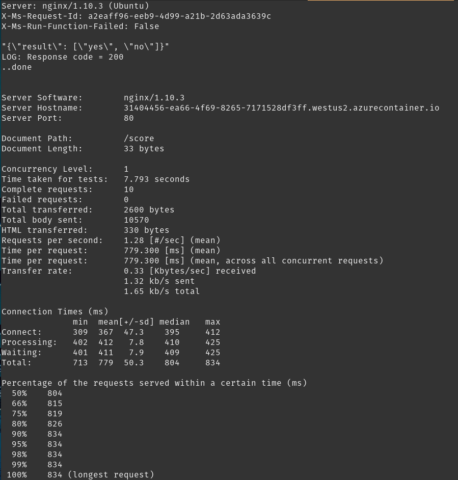

7. **Create and publish a pipeline**
    - Run the notebook `aml-pipelines-with-automated-machine-learning-step.ipynb` to create the pipelines.
    
    **Created pipeline**
    - Create an Auto ML pipeline

    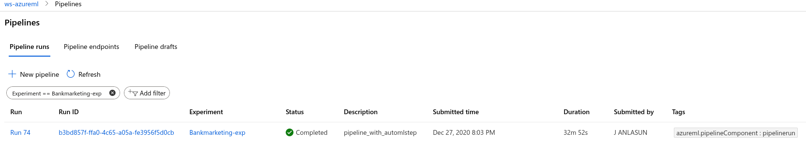

    **Pipeline Endpoint**
    - Create a pipeline for the REST API endpoint.

    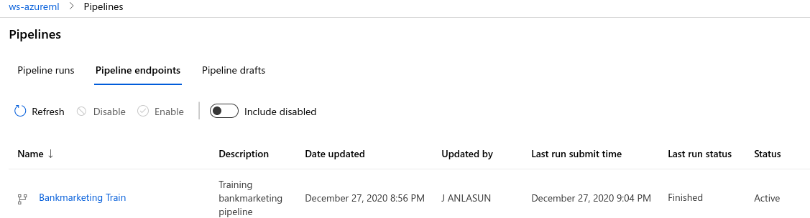

    **Dataset with AutoML module**
    - Confirmation of Auto ML pipeline and Bankmarketing dataset

    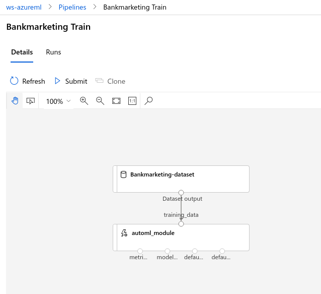

    **Published Pipeline**
    - Confirmation of the Published pipeline endpoint.

    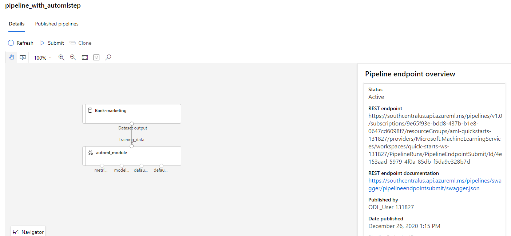

    **RunDetails Widget**
    - Notebook confirmation of the pipeline run details.

    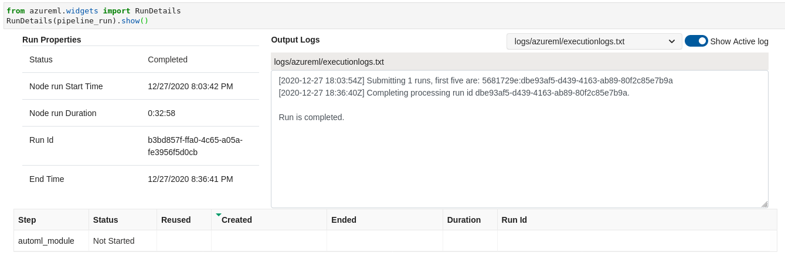  

    **ML Studio Scheduled run**
    - Azure ML studio confirmation of the pipeline scheduled run.

    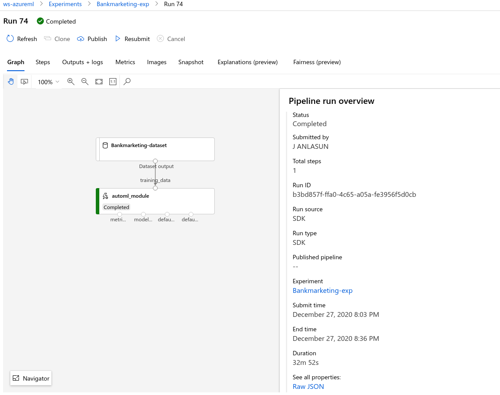

 

8. **Documentation**

## Screen Recording

The link below provides access to the video demonstration of a working machine learning application for the project.

[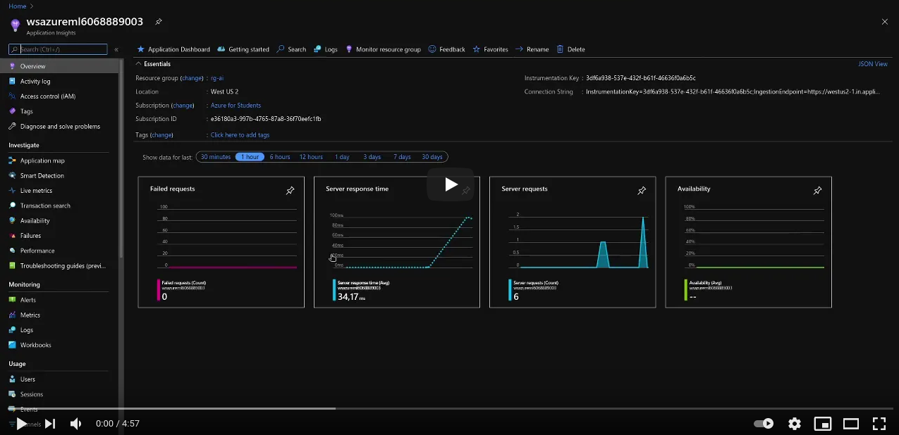](https://www.youtube.com/watch?v=FPQz4voAjTg)

## Future Improvement
To improve the project in the future, the following would be considered:
1. Automate the ML lifecycle with Jenkins or GitHub and Azure Pipelines to create a continuous integration process that trains the model whenever changes occur in the git repo.
2. Retrain the model on new data to detect data drift and performance degradation.
3. Publish key events to Azure EventGrid that would alerts on events in the ML lifecycle.
4. Convert the model to ONNX to improve performance.

