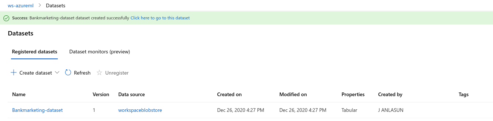
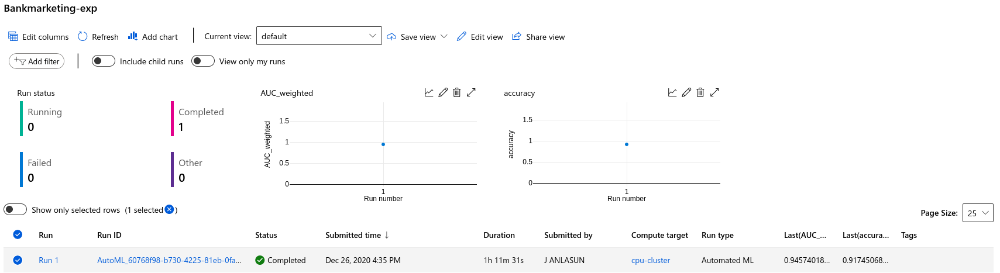
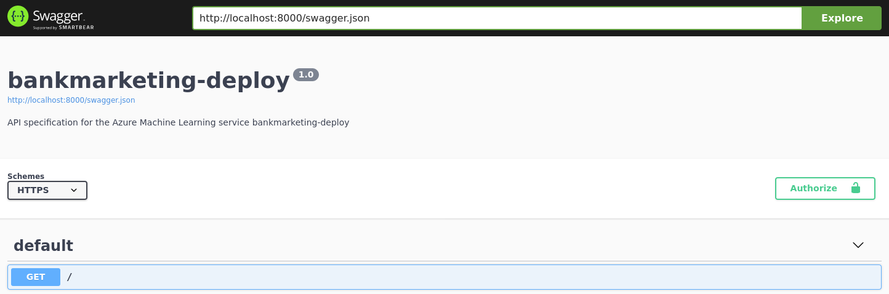
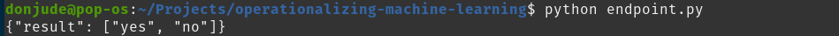
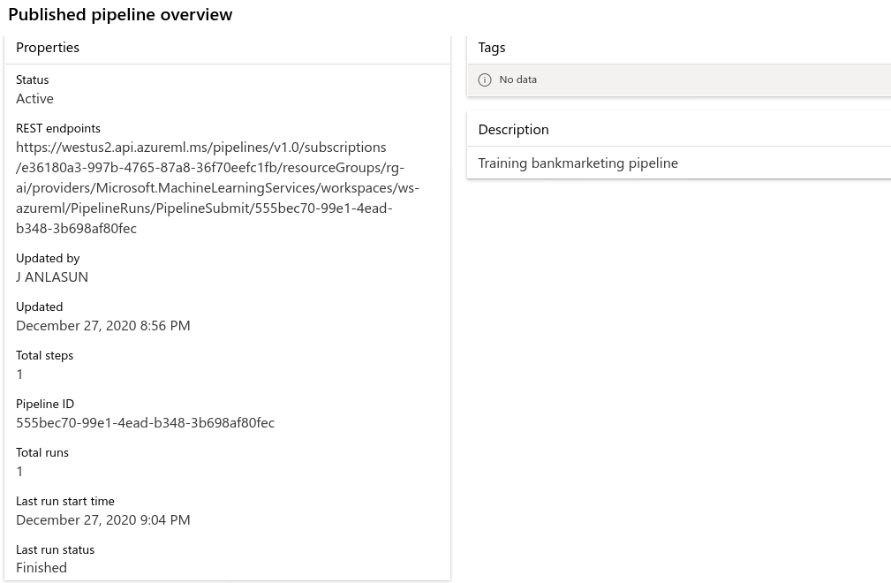

*NOTE:* This file is a template that you can use to create the README for your project. The *TODO* comments below will highlight the information you should be sure to include.

# Operationalizing Machine Learning

## Overview
This project is part of the Udacity Azure ML Engineer Nanodegree. It is the second project after the first project [Optimizing a Pipeline in Azure](https://github.com/donjude/nd00333_AZMLND_Optimizing_a_Pipeline_in_Azure-Solution), to build and productionalized an Azure Auto ML model.

The main focus of the project is about Productionalizing a Machine Learning Model, so we would not be focusing on optimization or creating a perfect machine learning model, but rather show the processes and the steps in which machine learning models in Azure ML are productionalized.

This project made use of the benchmarking dataset as described in [Project One](https://github.com/donjude/nd00333_AZMLND_Optimizing_a_Pipeline_in_Azure-Solution)

## Architectural Diagram
*TODO*: Provide an architectual diagram of the project and give an introduction of each step. An architectural diagram is an image that helps visualize the flow of operations from start to finish. In this case, it has to be related to the completed project, with its various stages that are critical to the overall flow. For example, one stage for managing models could be "using Automated ML to determine the best model". 

## Key Steps
*TODO*: Write a short discription of the key steps. Remeber to include all the screenshots required to demonstrate key steps.
Below are the various descriptions of the Key steps that were followed for the model productionalization.

1. **Authentication:** It is the process of verfifying the identify of a user or a process. In this project the authentication process that is used to authenticate the Azure Machine Learning workspace is the **Service Principal** authentication workflow. The service principal was used because of the automated process that is required for authentication during modeling training, updates and deployment processes that wouldn't require user interaction.

    > **Service Principal:** is a security identity used by user-created applications, services and automation tools to access specific Azure resources.

    **Authentication and Service Principal configuration**

2. **Automated ML Experiment:** At this step the machine learning experiment is created using Automated ML. This experiment consist of setting up your workspace, setting up your auto ml configurations, configuring a compute cluster and using the compute cluster to run the experiment. Several machine learning models are produced by this step in addition to the best model.

    **Registered Dataset**
    

    **Completed Experiment**
    

    **Best Model**
    
    

3. **Deploy the best model:** Deploying a machine learning model is the process of shipping machine learning models to production environment so that it can provide predictions that can be consumed by other processes, applications or software. Machine learning models only become useful when they are deployed because it is at this stage that the value of the modelling process can be realized.

    **Model Deployment**
    

4. **Enable logging:**

    **Application logging**
    

    **logging with** `log.py`
    

5. **Swagger Documentation:** Swagger is a tool that helps build, document, and consume RESTful web services. It eases the documentation efforts of HTTP APIs. Azure supports Swagger and in this project Swagger was used to consume the API for the deployed Machine Learning model.

    
    
    

6. **Consume model endpoints:** The deployed machine learning model can be consumed through a model endpoint. An endpoint is an HTTP API or URL(s) that is exposed over the network so that interactions can happened with a trained model via HTTP requests (GET or POST).

    

    **Benchmarking** Benchmarking was screated to enhance performance and also for the purpose of anomally detection.
    

7. **Create and publish a pipeline**
    
    **Created pipeline**
    

    **Pipeline Endpoint**
    

    **Dataset with AutoML module**
    

    **Published Pipeline**
    

    **RunDetails Widget**
      

    **ML Studio Scheduled run**
    

Documentation

## Screen Recording
*TODO* Provide a link to a screen recording of the project in action. Remember that the screencast should demonstrate:

## Standout Suggestions
*TODO (Optional):* This is where you can provide information about any standout suggestions that you have attempted.
